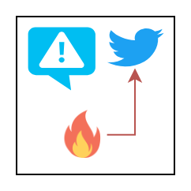

# Research
**[Home](/)** | **[Teaching](/teach)** | **Research** | **[Publications](/publications)**

## Social media sensing to prevent forest fire

In our innovative project, we leverage social media sensing and employ Natural Language Processing (NLP) techniques to prevent forest fires proactively. By analyzing social media conversations, we aim to detect early signs and sentiments related to potential fire hazards, allowing for swift preventive measures and safeguarding our natural landscapes.
